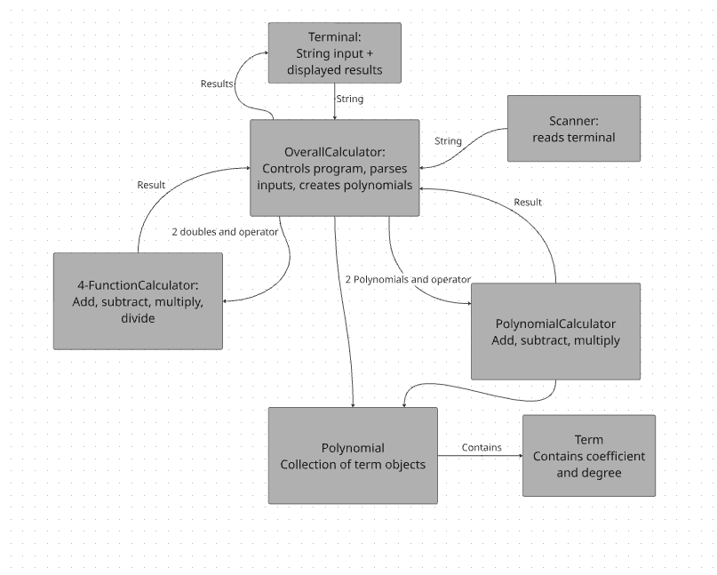
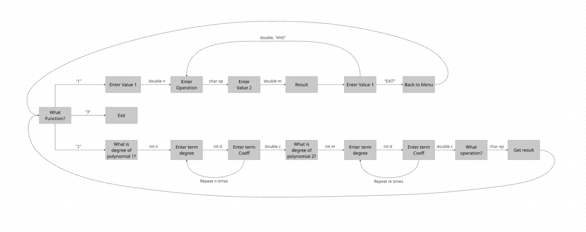

# myFieldCalc — CS 2114 Project 1 (Group 101)

A command-line calculator with four modes:

1. **Four-function calculator.** Add, subtract, multiply, and divide decimal numbers.
   Type `ANS` to reuse the last answer.
2. **Polynomial calculator.** Enter two polynomials, then add, subtract, or multiply them.
3. **Derivative calculator.** Enter a polynomial and an x value to get y and y′ at that x.
4. **Integral calculator.** Enter a polynomial and two bounds to get the area under it.

Bad input never crashes the program. It prints what went wrong and asks again.

## Run it

**Eclipse:** open `src/calculator/OverallCalculator.java`, then **Run As → Java Application**.
(If you just cloned the repo, first use **File → Import → Existing Projects into Workspace**.)

**Command line** (from this folder):

```
javac -d bin -sourcepath src src/calculator/OverallCalculator.java
java -cp bin calculator.OverallCalculator
```

## Use it

At the menu, type **1** (four-function), **2** (polynomial), **3** (quit),
**4** (derivative), or **5** (integral).

**Four-function:** enter a number, an operator (`+ - * /`), and a second number.
Type `ANS` for the last answer, or `EXIT` to go back to the menu.

```
5    +  8   →  Result: 13
ANS  *  2   →  Result: 26
```

**Polynomial:** enter each polynomial's degree, then its coefficients from the highest
power down. Leave a coefficient blank to use 0. Then pick `+`, `-`, or `*`.

```
(x + 2) * (x + 3)   →   The resulting polynomial is: x^2 + 5x + 6
```

**Derivative:** enter a polynomial the same way, then an x value.

```
3x^2 + 2x + 1 at x = 2   →   At x = 2, y = 17 and y' = 14
```

**Integral:** enter a polynomial the same way, then a lower bound, an upper bound,
and an even number of intervals from 2 to 100.

```
3x^2 + 2x + 1 from 0 to 2, 4 intervals   →   The integral ... is 14
```

The integral uses Simpson's rule. It is exact for polynomials up to degree 3.
For higher degrees it is a close estimate that gets better with more intervals.

**Bad input the program catches:** letters where a number goes, a wrong operator,
dividing by 0, a result too large to calculate, a degree that is negative,
a decimal, or over 100, and a number of intervals that is not even.

## Run the tests

In Eclipse, right-click `src` and choose **Run As → JUnit Test**.
The tests use the course's `CS2-Support` project, which must be in your workspace.

## Design

| Class | Job |
|---|---|
| `OverallCalculator` | Menu, reading input, and checking input (the `parse…` methods) |
| `FourFunctionCalculator` | `+ - * /` on decimals and remembers the last answer |
| `PolynomialCalculator` | `+ - *` on two `Polynomial`s |
| `DerivativeCalculator` | Evaluates a polynomial and its derivative at an x value |
| `IntegralCalculator` | Estimates the integral of a polynomial with Simpson's rule |
| `Polynomial` | A list of `Term`s |
| `Term` | One coefficient and degree, like `5x^3` |

### System diagram

From our Deliverable 2 spec. `DerivativeCalculator` and `IntegralCalculator` were added
after it, as stretch goals.



### User flow


